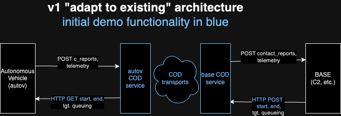

# Common Operational Database (COD) for Autonomous Vehicles and Base operations

The following diagram depicts the initial architecture of the COD integration:

For the first demo, we will implement the features colored blue.

The API specifications for each service can be found here:

-   [Base COD Server](base-cod.md)
-   [AutoV COD Server](autov-server.md)

An overview of the Ditto SDK integration is here:

-   [Ditto SDK Integration](ditto-sdk.md)

The demo UI is covered [here](../ui/README.md).

For some detail on building and executing COD nodes as/from containers:

-   [COD Nodes as Containers](../container/README.md).
